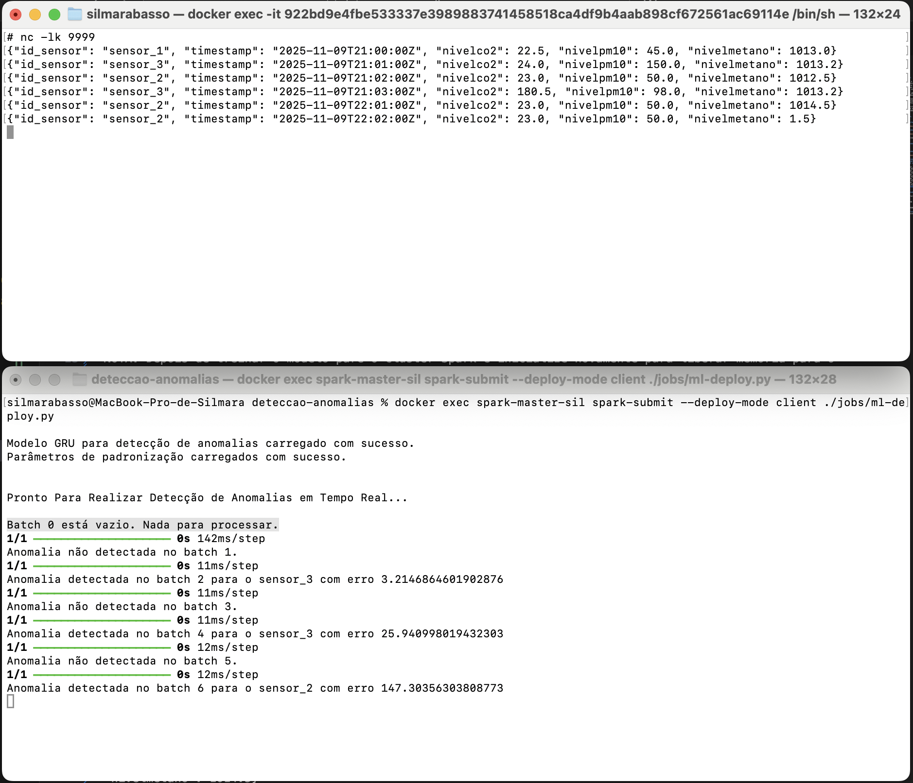

# deteccao-anomalias

Sistema  de análise e detecção de anomalias projetado para processar dados de sensores em tempo real.
Utilizando o Spark Streaming, o pipeline coleta dados em tempo real, aplica transformações e padronizações para prepará-los para análise e, em seguida, usa um modelo de aprendizado de máquina com TensorFlow para identificar anomalias. Esse pipeline é ideal para monitoramento contínuo em ambientes de loT (Internet of Things), fábricas e sistemas de alerta, garantindo respostas rápidas a comportamentos inesperados nos dados.

Os dados de amostra não são etiquetados e não possuem anomalias, por isto foi necessario usar a tecnica de reconstrução dos dados com o modelo GRU.

A arquitetura recorrente GRU (Gated Recurrent Unit) é uma variante das redes neurais recorrentes (RNNs) projetada para resolver alguns problemas das RNNs tradicionais, como a perda de informações ao longo do tempo e o treinamento ineficiente. 

O código da função cria-modelo-anomalia() define um modelo de rede neural recorrente baseado na arquitetura GRU para detecção de anomalias, utilizando uma abordagem de aprendizado não supervisionado. A ideia principal é que o modelo aprenda a reconstruir os dados de entrada e use o erro de reconstrução como um indicador para detectar anomalias. 

# Pipeline de Coleta, Transformação e Modelagem Preditiva em Tempo Real com Spark Streaming e TensorFlow

# Inicializar o Cluster

`docker compose -f docker-compose.yml up -d --scale spark-worker-sil=2`

# Execute este comando no host para treinar e salvar o modelo e o padronizador

`docker exec spark-master-sil spark-submit --deploy-mode client ./jobs/ml-treina.py`

NOTA: Depois de treinar o modelo pare o cluster Spark e inicialize novamente para liberar memória para o deploy!!!

# Execute este comando dentro do node master para carregar um shell de dados em tempo real

`nc -lk 9999`

# Execute este comando no host para capturar dados em tempo real e entregar a previsão

`docker exec spark-master-sil spark-submit --deploy-mode client ./jobs/ml-deploy.py`

# De volta ao container, digite cada uma das linhas abaixo, pressione Enter e observe o modelo fazendo a previsão em tempo real
# As linhas 2, 4 e 6 são anomalias

`{"id_sensor": "sensor_1", "timestamp": "2025-11-09T21:00:00Z", "nivelco2": 22.5, "nivelpm10": 45.0, "nivelmetano": 1013.0}`
`{"id_sensor": "sensor_3", "timestamp": "2025-11-09T21:01:00Z", "nivelco2": 24.0, "nivelpm10": 150.0, "nivelmetano": 1013.2}`
`{"id_sensor": "sensor_2", "timestamp": "2025-11-09T21:02:00Z", "nivelco2": 23.0, "nivelpm10": 50.0, "nivelmetano": 1012.5}`
`{"id_sensor": "sensor_3", "timestamp": "2025-11-09T21:03:00Z", "nivelco2": 180.5, "nivelpm10": 98.0, "nivelmetano": 1013.2}`
`{"id_sensor": "sensor_2", "timestamp": "2025-11-09T22:01:00Z", "nivelco2": 23.0, "nivelpm10": 50.0, "nivelmetano": 1014.5}`
`{"id_sensor": "sensor_2", "timestamp": "2025-11-09T22:02:00Z", "nivelco2": 23.0, "nivelpm10": 50.0, "nivelmetano": 1.5}`

# Copie o banco de dados do container para o host e com o DB Browser vc pode ver os dados armazenados e criar KPIs por exemplo ou automatizar outras ações necessarias para a anomalia detectada

`docker cp spark-master-sil:/opt/spark/modelos/sildb.db .`

# Spark Master
http://localhost:9090

# History Server
http://localhost:18080

# Para desligar o Cluster
`docker compose -f docker-compose.yml down`

